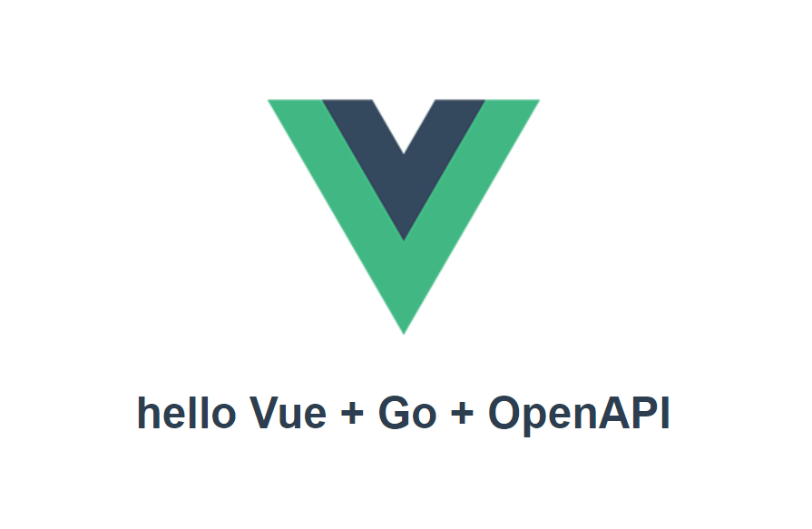

# go-vue-openapi-fullstack-webapp
go-vue-openapi-fullstack-webapp is sample application.



# archtecture

## Frontend

Frontend is Vue * TypeScript apprication with [Vue CLI](https://cli.vuejs.org/).
API Client is generated by [openapi-generator](https://github.com/OpenAPITools/openapi-generator).

## Backend

Backend is generated-by [go-swagger](https://github.com/go-swagger/go-swagger).

Backend and API Client of Frontend is generated from the same swagger.yaml.

## Integration

Frontend app is build on `dist` directory.
`app/main.go` uses it as file system by `go:embed`.
`app/main.go` also uses `server` package, and serve frontend and backend on `localhost:3000`
If you build app by `go build`, you can use this integration as single binaly application.

# Usage

## serve on localhost:3000

```
cd app
go run main.go
```

## run only frontend to debug

```
cd app/frontend
npm run serve
```

## run only backend to debug

```
cd server
go run gen\cmd\factory-server\main.go --host 0.0.0.0 --port 3000
```

## build frontend

```
cd app/frontend
npm run build
```

## generate API Client of frontend from swagger.yaml

```
cd app
npx -p @openapitools/openapi-generator-cli@cli-4.1.3 openapi-generator generate -g typescript-axios -i ../../swagger.yaml -o ./frontend/src/client-axios -p modelPropertyNaming=snake_case --enable-post-process-file
```

## generate backend from swagger.yaml

```
 swagger generate server -a factory -A factory -t server/gen -f ./ swagger.yaml
```


